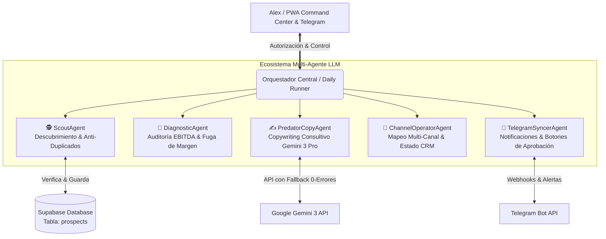

# 🦅 ARCHITECT.SYS SCOUT COMMAND CENTER (PWA)
## Plan de Arquitectura para el Motor Visual de Prospección Agresiva y Cierre High-Ticket

Este documento presenta la investigación, arquitectura modular y hoja de ruta para construir la **Casa Visual de los Agentes de Prospección (`Architect.Sys Scout Command Center`)**. Nuestro objetivo financiero y operativo es categórico: **cerrar al menos 5 clientes High-Ticket al mes** (generando entre 7.500 € y 15.000 €/mes de facturación nueva recurrente/directa), manteniendo un control ejecutivo absoluto por parte de Alex mediante un bucle de autorización en Telegram y una interfaz PWA instalable en cualquier dispositivo.

---

## 🔬 1. Investigación de Mercado: ¿Cómo operan las herramientas de élite?

Al analizar las plataformas líderes mundiales de prospección y automatización B2B (*Clay.com, LaGrowthMachine, Instantly.ai, Apollo.io, HeyReach*), identificamos 4 pilares estructurales que incorporaremos y superaremos en nuestro ecosistema:

1. **Enriquecimiento en Cascada y Tabla Dinámica (Estilo *Clay.com*):**
   * *Cómo lo hacen:* Utilizan tablas donde cada celda ejecuta un prompt o scraping para enriquecer el lead.
   * *Nuestra evolución gastronómica:* Creamos una **Tabla Diagnóstica en Tiempo Real** donde cada restaurante descubierto es evaluado financieramente: detectamos automáticamente si usa carta PDF, si paga tributo a El Tenedor (12-15% comisión) y calculamos su **Fuga de Margen Mensual (EBITDA perdido)**.
2. **Máquinas de Estado Multi-Canal (Estilo *LaGrowthMachine / HeyReach*):**
   * *Cómo lo hacen:* Mapean el estado de cada prospecto por canal para no repetir ni cruzar mensajes.
   * *Nuestra evolución:* Un sistema de estados centralizado (`DISCOVERED` ➔ `PENDING_APPROVAL` ➔ `APPROVED_BY_ALEX` ➔ `WHATSAPP_SENT` ➔ `EMAIL_SENT` ➔ `IG_DM_SENT` ➔ `MEETING_BOOKED`). Ningún agente dispara sin tu autorización expresa.
3. **Escudo Anti-Duplicados y CRM Dedup (Estilo *Instantly / Smartlead*):**
   * *Cómo lo hacen:* Índices únicos por dominio o teléfono para evitar contactar al mismo negocio dos veces.
   * *Nuestra evolución:* Integración directa con Supabase con validación anti-colisión por teléfono, dominio y handle de Instagram/Facebook. Si un local ya está en la base de datos (sea prospectado, contactado o rechazado), el agente lo bloquea automáticamente y busca uno nuevo.
4. **Instalabilidad Universal (PWA Nativa):**
   * *Nuestra evolución:* A diferencia de los SaaS pesados de escritorio, nuestra app se construye como una **Progressive Web App (PWA)** en Next.js. Podrás instalarla como app nativa en tu iPhone (Safari -> Añadir a pantalla de inicio), Android, iPad o Mac/PC con un solo clic, funcionando rápida, fluida y con acceso directo al sistema.

---

## 🏗️ 2. Arquitectura Modular Multi-Agente (Cero Monolitos)

Para garantizar un rendimiento industrial, seguridad y escalabilidad, eliminamos cualquier estructura monolítica. Dividimos el cerebro de prospección en **5 Agentes LLM Especializados y Desacoplados**, coordinados por un Orquestador Central:

### Funciones de cada Cerebro Especializado (`src/prospecting-engine/agents/`):
1. **`ScoutAgent.ts` (El Descubridor):** Escanea Google Maps, redes sociales y directorios hosteleros. Antes de procesar un lead, consulta la base de datos de Supabase. Si el teléfono o web ya existe, lo descarta.
2. **`DiagnosticAgent.ts` (El Auditor Financiero):** Aplica algoritmos de estimación gastronómica. Cruza volumen de reseñas con tipo de cocina para estimar facturación mensual y calcula el dinero exacto que pierden en comisiones y falta de upselling visual.
3. **`PredatorCopyAgent.ts` (El Cerrador High-Ticket):** Conectado a **Google Gemini 3 Pro / Gemini 3 Flash** (última generación 2026). Genera los 3 ganchos (WhatsApp, Instagram DM, Email). Aplica reglas anti-bot: mensajes cortos, tono de consultor a dueño, y sin enlaces spameros en el primer contacto.
4. **`ChannelOperatorAgent.ts` (El Gestor de Canales):** Lleva el registro minucioso de qué canal se tocó, cuándo y qué respuesta hubo. Te permite registrar si entraste tú como Alex en Instagram, LinkedIn, Facebook o WhatsApp.
5. **`TelegramSyncerAgent.ts` (El Enlace de Mando):** Envía las tandas diarias a tu Telegram con botones interactivos o comandos limpios. Si autorizas la tanda en Telegram o en la PWA, el estado cambia automáticamente a `APPROVED` para iniciar el contacto.

---

## 🤖 3. Integración y Seguridad de Google Gemini 3 API (0 Errores)

Para que los agentes operen 24/7 sin fallos de cuota, caídas o errores de parseo, implementamos una arquitectura de resiliencia de 3 capas con la última tecnología de IA:
* **Selección Inteligente de Modelo (Gemini 3):** Utilizaremos **`gemini-3.0-pro` (o superior)** para diagnósticos profundos y razonamiento estratégico consultivo, y **`gemini-3.0-flash`** para el procesamiento ultrarrápido en lote de grandes volúmenes de leads.
* **Manejo de Excepciones y Backoff Exponencial:** Si la API de Gemini experimenta latencia o límite de tasa (Rate Limit), el sistema espera 2 segundos y reintenta automáticamente hasta 3 veces.
* **Capa de Fallback Consultivo de Élite:** Si por cualquier motivo externo la API no respondiera, el agente cambia instantáneamente al **Motor de Plantillas Consultivas Matemáticas**, garantizando que la prospección jamás se detenga ni arroje un error en pantalla.

---

## 📂 4. Estructura de Carpetas y Archivos Propuestos

### A. Frontend: Centro de Mando Visual PWA (`src/app/admin/scout/`)
* **`page.tsx`**: Dashboard Principal con pestañas (Vista Pipeline/Kanban, Vista Tabla Estilo Clay, Vista de Aprobación Telegram, Configuración).
* **`components/scout/ScoutKPIs.tsx`**: Tarjetas de métricas rápidas (Leads Hoy, Aprobados por Alex, Mensajes WhatsApp Enviados, Reuniones Agendadas, EBITDA Pipeline).
* **`components/scout/ScoutKanban.tsx`**: Tablero visual drag-and-drop por estados (`Por Aprobar`, `Aprobados`, `Contactados WhatsApp`, `Contactados IG/Email`, `Respuesta Recibida`, `Reunión Agendada`, `Cerrado / Venta`).
* **`components/scout/ScoutTable.tsx`**: Tabla de alta densidad con filtros por ciudad, nota de Google, dolor operativo y puntuación ICP.
* **`components/scout/LeadDetailModal.tsx`**: Modal interactivo al hacer clic en un restaurante: muestra la radiografía completa, permite editar notas, ver el historial multi-canal y copiar los hooks de WhatsApp/IG con un clic.
* **`components/scout/TelegramConfigCard.tsx`**: Panel visual para poner tu Token de Bot y Chat ID, probar conexión y activar/desactivar alertas automáticas.

### B. PWA & Configuración Móvil
* **`public/manifest.json`**: Configuración para instalación nativa en iOS/Android/PC (nombre: *Architect Scout*, iconos, color de tema negro/naranja).

### C. Backend Modular & Base de Datos (`src/prospecting-engine/`)
* **`agents/ScoutAgent.ts`**: Lógica de búsqueda y filtro anti-duplicados.
* **`agents/DiagnosticAgent.ts`**: Lógica de cálculo financiero EBITDA.
* **`agents/PredatorCopyAgent.ts`**: Conector Gemini 1.5 + Fallback.
* **`agents/ChannelOperatorAgent.ts`**: Mapeo y transiciones de estado multi-canal.
* **`agents/TelegramSyncerAgent.ts`**: Sincronización bidireccional con Telegram.
* **`orchestrator.ts`**: Coordinador central que reemplaza al antiguo runner monolítico.
* **`schema_prospects.sql`**: Esquema de tabla Supabase (`prospects`) con índices únicos y políticas de seguridad.

---

## 🎯 5. Flujo de Trabajo y Sinergia Contigo (El Camino hacia los 5 Clientes/mes)

1. **Ronda de Descubrimiento (08:00 AM o a petición tuya):** El `ScoutAgent` y `DiagnosticAgent` escanean 100 locales, descartan duplicados y calculan pérdidas.
2. **Generación de Armas de Venta:** El `PredatorCopyAgent` redacta los hooks hiper-personalizados para los Top 20 ICPs.
3. **Notificación y Aprobación (Sinergia Telegram + PWA):** Te llega una alerta a Telegram y al Command Center. Revisas la lista. Con un clic en **"✅ Autorizar Ronda"**, los prospectos quedan desbloqueados.
4. **Acción Agresiva Multi-Canal:**
   * **WhatsApp (Manual por Alex para seguridad 100% anti-ban):** Abres la PWA en tu móvil o Telegram, tocas el texto del hook (se copia solo), abres WhatsApp y se lo envías al dueño del restaurante. Marcas *"Enviado por WhatsApp"*.
   * **Instagram / LinkedIn / Facebook:** Si decides entrar a su IG o LinkedIn, copias el hook corto de IG, se lo envías por DM y marcas el canal en la app.
   * **Email:** Puedes ordenar al agente que dispare el email ejecutivo automáticamente vía Resend/Nodemailer a los autorizados.
5. **Cierre de Reunión:** Cuando el hostelero responde intrigado por su fuga de margen, le compartes el enlace a la radiografía interactiva (`/hub`) o agendas llamada de cierre en tu Calendly para cobrar la implementación High-Ticket.

---

## ⚠️ Revisión del Usuario Requerida & Preguntas Abiertas

> [!IMPORTANT]
> **Aprobación de Arquitectura:** Por favor revisa este plan. Al aprobarlo, procederé a crear la tabla en Supabase, los 5 agentes modulares, el manifiesto PWA y la interfaz visual del Command Center en `/admin/scout`.

> [!TIP]
> **Pregunta Rápida para Alex:** ¿Te parece bien situar el Command Center en la ruta **`https://hosteleria.architectsys.com/admin/scout`** (dentro de nuestro mismo dominio y ecosistema actual, protegido por un código PIN de acceso rápido o tu sesión de admin), o prefieres otra ruta? (Recomiendo `/admin/scout` para tener todo unificado en un solo portal).
